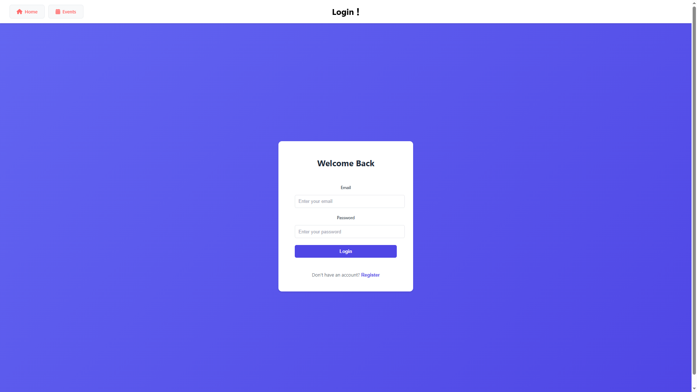
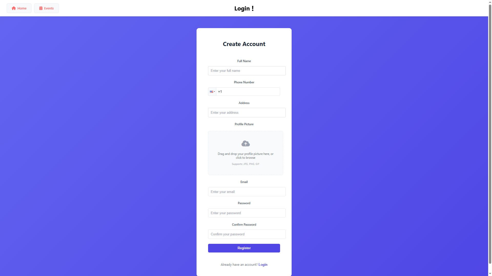

# Project Structure Guide

This repository contains a full-stack Event Booking application, organized as follows:

## Root Structure

- **FE/** — Frontend (React)
  - `my-app/` — Main React project
    - `src/` — Source code (components, pages, services, context)
    - `public/` — Static assets and HTML
    - `README.md` — Frontend usage and setup
- **BE/** — Backend (Spring Boot)
  - `src/` — Java source code and resources
    - `main/java/com/booking/` — Java packages (controllers, services, entities, etc.)
    - `main/resources/` — Config files (application.properties, data.sql)
  - `pom.xml` — Maven build config
  - `README.md` — Backend usage and setup
- **uploads/** — Uploaded images for users and events
  - `users/` — User profile images
  - `events/` — Event images

## How it Works
- The **frontend** (FE) is a React app for users and admins to interact with events and user management.
- The **backend** (BE) is a Spring Boot REST API that handles authentication, event management, user management, and file uploads.
- The **uploads** folder is used by the backend to store and serve images for users and events.
- Both FE and BE have their own README files for setup and usage instructions.

---

## Screenshots

Here are some pages from the final website:

*Home Page*

*Login Page*

*Register Page*

*User Dashboard*

*Admin Dashboard*

*Booked Events*

*Edit User Modal*

*Edit User Form (Compact)*

---
This file provides a high-level overview for new developers and maintainers.

### 🔗 More Information

I'll be posting a walkthrough on my [LinkedIn profile](https://www.linkedin.com/in/omar-farouk-b9276b274/).  
Feel free to connect or follow for updates!
